<div align="center">
  

  <h1>Oto for Windows</h1>

  <p><strong>Fast, system-wide push-to-talk dictation for Windows.</strong></p>
  <p>Hold a shortcut, speak naturally, and release. Oto transcribes your voice, optionally cleans up the writing, and delivers the result to the app you were already using.</p>

  <p>
    
    
    
    
    
  </p>
</div>

Oto is a native Windows voice-input utility built with **Tauri 2**, **Rust**, and **SvelteKit**. The interaction is intentionally small: press and hold a global shortcut while you talk, then release when you are done. A compact, non-focusable overlay shows state without stealing focus from the destination app.

This repository is the **Windows port** of [Oto](https://github.com/0veek/oto) (see also the [macOS port](https://github.com/0veek/oto-mac)), with Win32 text injection, Windows Credential Manager for secrets, focus restore, tray controls, and NSIS/MSI packaging.

<p align="center">
  
</p>

> [!IMPORTANT]
> Oto is currently at version `0.1.0`. It is usable day to day, but configuration fields, provider behavior, and packaging details may change before a stable release. There is no automatic updater yet.

---

## Why Oto

Most dictation tools force a choice between a cloud-only service, a local model with a developer-oriented interface, or an intrusive floating window. Oto keeps the interaction small while making the pipeline configurable:

- **System-wide push-to-talk** — dictate into browsers, editors, chat apps, notes, terminals, and other Windows applications.
- **Cloud or on-device transcription** — OpenAI-compatible speech endpoints or a local whisper.cpp-compatible model.
- **Optional writing cleanup** — punctuation, grammar, filler words, and tone before insertion.
- **Reusable writing tools** — personal dictionary, exact-match voice snippets, and style presets.
- **Selected-text commands** — select text and say instructions such as “make this concise” or “translate this to Spanish.”
- **Layered delivery** — restore the target window, then try clipboard + `Ctrl+V`, Unicode typing, then clipboard-only.
- **Local-first configuration** — settings and history stay on disk; API keys live in Windows Credential Manager.
- **Restrained UI** — graphite settings window and a small liquid-glass-style overlay (~220×36).

---

## How it works

```mermaid
flowchart LR
    A["Hold the global shortcut"] --> B["Capture the focused window"]
    B --> C["Record microphone audio"]
    C --> D["Release the shortcut"]
    D --> E{"Transcription backend"}
    E -->|Cloud| F["OpenAI-compatible speech API"]
    E -->|Local| G["whisper-rs / whisper.cpp"]
    F --> H["Raw transcript"]
    G --> H
    H --> I{"Session type"}
    I -->|Dictation| J{"Exact snippet match?"}
    J -->|Yes| K["Expand snippet"]
    J -->|No| L{"Polish enabled?"}
    L -->|Yes| M["Chat-completions cleanup"]
    L -->|No| N["Keep raw transcript"]
    I -->|Command Mode| O["Rewrite selected text"]
    K --> P["Deliver final text"]
    M --> P
    N --> P
    O --> P
    P --> Q["Restore the target window"]
    Q --> R["Clipboard + Ctrl+V"]
    R -->|Unavailable| S["Synthetic Unicode typing"]
    S -->|Unavailable| T["Keep transcript on clipboard and show an error"]
```



### Overlay states

| State | Meaning |
| --- | --- |
| **Listening** | Microphone is active; Oto is collecting audio. |
| **Processing** | Transcribing, expanding a snippet, polishing, rewriting, or inserting. |
| **Inserted** | Text reached the destination via an automatic delivery method. |
| **Error** | Provider, audio, or insertion failed. On insert failure, the transcript is left on the clipboard so you can paste with `Ctrl+V`. |

---

## Feature overview

### Dictation and transcription

- Press-and-hold global shortcut with separate key-down / key-up handling.
- Native microphone capture through `cpal` (WASAPI on Windows), with multichannel-to-mono downmixing.
- OpenAI-compatible `/audio/transcriptions` support (OpenAI, Groq, OpenRouter, custom endpoints).
- Local transcription through `whisper-rs` and whisper.cpp-compatible `ggml` model files.
- Optional language hinting and automatic language detection.
- Dictionary-based vocabulary prompting for names, technical terms, and preferred spellings.
- Optional partial results with Local Whisper (preview about every 1.8s; preview failures never abort the final pass).

### Writing assistance

- Optional chat-completions pass for grammar, punctuation, capitalization, and filler cleanup.
- Configurable polish model, temperature, language, style preset, and free-form tone hint.
- Exact-utterance snippets (voice macros); partial phrases inside normal dictation do not expand by accident.
- Built-in starter styles (professional, casual, email, code comments) plus custom presets.
- Command Mode: rewrite selected text from a spoken instruction.
- Graceful polish fallback: if cleanup fails, dictation continues with the raw transcript.

### Windows integration

- **System tray** — Start Listening, Stop Listening, Command Mode, Open Settings, Quit.
- Non-focusable, always-on-top overlay that does not capture keyboard input.
- Target-window capture at PTT press and focus restoration before delivery.
- Text injection via Win32 `SendInput` (`Ctrl+V` and Unicode typing).
- Overlay positioning near the bottom center of the monitor, with persisted drag coordinates.
- Settings window with a custom title bar (minimize / close) matching the Oto shell.

### Data and privacy

- API keys and sync bearer tokens are stored in **Windows Credential Manager** (service `dev.oto.win`).
- Ordinary settings are plain JSON **without** credential fields.
- Dictation history is optional, local, individually removable, clearable, and capped (1–1000 entries).
- User-controlled JSON sync is **off by default** and only includes dictionary terms, snippets, and styles.
- Sync requires HTTPS except explicit `localhost` development endpoints.
- Oto does **not** sync provider keys, history, audio, or credentials.
- No telemetry or analytics is integrated in this repository.

---

## Requirements

### End users (running a built app)

| Requirement | Notes |
| --- | --- |
| **Windows 10 or newer** | x64. |
| **WebView2 Runtime** | Usually preinstalled on modern Windows; the installer can bootstrap it. |
| **Microphone** | Required for dictation. |
| **Provider API key** | Required for cloud STT / polish / Command Mode. Not required for unauthenticated local endpoints. |

### Developers (building from source)

| Requirement | Notes |
| --- | --- |
| **Node.js 18+** and npm | Frontend toolchain. |
| **Rust stable** (`rustup`) | Backend and Tauri. |
| **Visual Studio Build Tools** | “Desktop development with C++” (MSVC, Windows SDK). |
| **CMake** | Bundled with VS Build Tools or install Kitware CMake. |
| **LLVM** | Provides `libclang.dll` for `whisper-rs-sys` / bindgen. |

Install LLVM if missing:

```powershell
winget install --id LLVM.LLVM -e
```

The default path used by this project is:

```text
C:\Program Files\LLVM\bin\libclang.dll
```

Without it, the classic failure looks like:

```text
Unable to find libclang: "couldn't find any valid shared libraries matching: ['clang.dll', 'libclang.dll']"
```

---

## Installation

### Option A — Installer (recommended when releases exist)

1. Download `Oto_0.1.0_x64-setup.exe` (NSIS) or `Oto_0.1.0_x64_en-US.msi` from the repository **Releases** page.
2. Run the installer.
3. Launch **Oto** from the Start menu (or tray after first run).
4. Open Settings, choose a provider, save an API key, and set a hotkey if desired.

### Option B — Run the release binary from a local build

After building (see below):

```text
src-tauri\target\release\oto.exe
src-tauri\target\release\bundle\nsis\Oto_0.1.0_x64-setup.exe
src-tauri\target\release\bundle\msi\Oto_0.1.0_x64_en-US.msi
```

---

## Build from source

### 1. Clone and install frontend dependencies

```powershell
git clone https://github.com/0veek/oto-win.git
cd oto-win
npm install
```

### 2. Install Rust (if needed)

```powershell
winget install --id Rustlang.Rustup -e
# restart the shell, then:
rustup default stable
```

### 3. Install native toolchain pieces

- Visual Studio Build Tools with **C++** workload  
- LLVM (`winget install --id LLVM.LLVM -e`)

### 4. Development run

Use the project wrappers so MSVC, CMake, and `LIBCLANG_PATH` are set automatically:

```powershell
npm run tauri:dev
```

Equivalent:

```powershell
npm run tauri -- dev
```

### 5. Release build (exe + installers)

```powershell
npm run tauri:build
```

Outputs:

| Artifact | Typical path |
| --- | --- |
| Executable | `src-tauri\target\release\oto.exe` |
| NSIS setup | `src-tauri\target\release\bundle\nsis\Oto_0.1.0_x64-setup.exe` |
| MSI | `src-tauri\target\release\bundle\msi\Oto_0.1.0_x64_en-US.msi` |

### Build environment notes

- `scripts/dev-env.ps1` loads VS DevCmd, prepends LLVM, and prepares CMake.
- `scripts/tauri.ps1` is used by `npm run tauri*` so bare shells still get a correct toolchain.
- `src-tauri/.cargo/config.toml` forces `LIBCLANG_PATH` for cargo even when the shell is incomplete.
- Prefer **`npm run tauri:build`** over bare `npx tauri build` unless you have already run `. .\scripts\dev-env.ps1` in that shell.
- Do **not** set `WHISPER_DONT_GENERATE_BINDINGS=1` on Windows. Bundled FFI bindings target Unix layouts and fail MSVC size checks. Always regenerate with bindgen + LLVM.

---

## First-run setup

1. Start Oto — Settings opens; a tray icon appears.
2. **Providers** — pick OpenAI / Groq / OpenRouter / Custom and save an API key (Credential Manager).
3. **Models** — choose STT backend (`cloud` or `local_whisper`), models, polish settings.
4. **Hotkeys** — default is `Ctrl+Shift+Space`. Save after changing.
5. **Injection** — leave **Auto** unless you need a specific mode; use **Test insertion**.
6. Hold the hotkey, speak into any text field in another app, release.

---

## Usage

| Action | How |
| --- | --- |
| **Dictate** | Hold the global hotkey → speak → release. |
| **Command Mode** | Select text in the target app → tray **Command Mode** (or configured flow) → speak the rewrite instruction. |
| **Settings** | Left-click the tray icon, or tray menu → Open Settings. |
| **Start / Stop without hotkey** | Tray → Start Listening / Stop Listening. |
| **Quit** | Tray → Quit. |

### Hotkey tips

- Supported modifiers: `Ctrl`, `Alt`, `Shift`, `Win` / `Super` / `Meta`.
- Keys: `Space`, `Enter`, `Tab`, `Escape`, `a`–`z`.
- Avoid reserved combos such as `Win+Space` (input language) and `Alt+Tab`.
- Prefer `Ctrl+Shift+Space` or `Ctrl+Shift+D`.
- Always **Save** after editing the hotkey.

---

## Settings map

| Section | Purpose |
| --- | --- |
| **Providers** | Preset or custom OpenAI-compatible endpoint; API key in Credential Manager. |
| **Models** | Cloud vs Local Whisper, STT/polish models, temperature, language, streaming. |
| **Hotkeys** | Global push-to-talk chord. |
| **Injection** | Delivery mode + insertion test. |
| **Dictionary** | Vocabulary boost terms. |
| **Snippets** | Exact-utterance expansions. |
| **Styles & commands** | Polish styles and Command Mode tone. |
| **History** | Local transcript history. |
| **Appearance** | Theme, motion, font scale, idle overlay behavior. |
| **Privacy** | History toggle; optional sync endpoint + token. |
| **About** | Version and privacy summary. |

There is **no** macOS-style Permissions pane on Windows. Microphone access is handled by the OS when you first record; injection uses standard Win32 input (see elevated-app note below).

---

## Injection modes

| Mode | Behavior | When to use |
| --- | --- | --- |
| **Auto** (default) | Clipboard + `Ctrl+V`, then Unicode typing, then clipboard-only + error. | Recommended. |
| **Direct type** | Synthetic Unicode key events character-by-character. | Apps that reject paste. |
| **Clipboard + paste** | Always copy, then simulate `Ctrl+V`. | Predictable paste-centric workflows. |
| **Clipboard only** | Copy and show success that requires manual paste. | Maximum safety / locked-down apps. |

### Elevated (Administrator) apps

Windows may block synthetic input from a **non-elevated** Oto into an **elevated** target (UIPI). If paste works everywhere except admin apps (elevated terminals, some installers), run both at the same privilege level or use **Clipboard only** and paste manually.

---

## Configuration and data locations

Oto uses the Rust `directories` crate. On Windows, config typically lives under:

```text
%APPDATA%\Oto\oto\config.json
```

| Data | Storage | Notes |
| --- | --- | --- |
| Settings (no secrets) | `%APPDATA%\Oto\oto\config.json` | Human-readable JSON. |
| Provider API keys | Credential Manager, service `dev.oto.win` | Never written into `config.json`. |
| Sync bearer token | Credential Manager | Only if you enable sync. |
| History | Local app data (when enabled) | Removable / clearable in Settings. |
| Injection debug log | `%TEMP%\oto-inject.log` | Written during insert attempts. |

Oto refuses to serialize a config that contains an `api_key` field. Clear a key by saving an empty value for that provider.

---

## Project structure

```text
oto-win/
├── package.json                 # npm scripts (tauri:dev, tauri:build)
├── scripts/
│   ├── dev-env.ps1              # MSVC + CMake + LIBCLANG_PATH
│   └── tauri.ps1                # Wrapper used by npm run tauri*
├── src/                         # SvelteKit UI (overlay + settings)
├── static/                      # Icons and readme assets
├── src-tauri/
│   ├── Cargo.toml               # Rust deps (cpal, whisper-rs, windows, tauri, …)
│   ├── tauri.conf.json          # Windows, overlay/settings windows, NSIS/MSI
│   ├── .cargo/config.toml       # Forces LIBCLANG_PATH for whisper bindgen
│   ├── capabilities/            # Tauri ACL
│   ├── icons/                   # App / tray icons
│   └── src/
│       ├── audio/               # Microphone capture + WAV
│       ├── commands/            # Tauri invoke handlers
│       ├── config/              # Models, JSON store, keyring
│       ├── features/            # History, snippets, sync
│       ├── hotkeys/             # Global PTT registration
│       ├── injection/           # Clipboard, focus, SendInput paste/type
│       ├── pipeline/            # Orchestrator + events
│       └── providers/           # Cloud STT/polish + local Whisper
└── README.md
```

---

## Troubleshooting

### Overlay never appears / hotkey does nothing

- Click **Save** after changing the hotkey.
- Try tray **Start Listening** (works without a global grab).
- Pick a non-reserved chord (`Ctrl+Shift+Space`).
- Another app may have registered the same shortcut.

### “Unable to find libclang”

```powershell
winget install --id LLVM.LLVM -e
# confirm:
Test-Path "C:\Program Files\LLVM\bin\libclang.dll"
npm run tauri:build
```

### `whisper-rs-sys` build fails with MSVC size errors

You likely forced `WHISPER_DONT_GENERATE_BINDINGS=1`. Unset it, ensure LLVM is installed, clean and rebuild:

```powershell
Remove-Item Env:WHISPER_DONT_GENERATE_BINDINGS -ErrorAction SilentlyContinue
Remove-Item -Recurse -Force src-tauri\target\release\build\whisper-rs-sys* -ErrorAction SilentlyContinue
npm run tauri:build
```

### Insertion fails / text only lands on clipboard

- Focus a real text field in the target app before releasing PTT.
- Try **Test insertion** in Settings → Injection.
- Check whether the target is elevated (see UIPI note above).
- Inspect `%TEMP%\oto-inject.log`.
- Fall back to **Clipboard only** and paste with `Ctrl+V`.

### Microphone test fails

- Confirm Windows has a default input device.
- Allow microphone access for Oto when Windows prompts.
- Close other apps that exclusively lock the device.

### Settings window closed and “disappeared”

Closing Settings **hides** the window (tray app). Reopen from the tray icon.

---

## Known limitations

- Version `0.1.0` — no automatic updater yet.
- Automatic insertion depends on the destination app; secure or custom controls may only accept clipboard paste.
- Local Whisper requires a large native compile (CMake + MSVC + LLVM) the first time.
- Elevated applications may ignore input from a non-elevated Oto process.
- There is no separate “permissions checker” UI on Windows (unlike macOS Accessibility).

---

## Related projects

- Upstream / cross-platform concept: [0veek/oto](https://github.com/0veek/oto)
- macOS port: [0veek/oto-mac](https://github.com/0veek/oto-mac) (or your fork)

---

## License

Apache License 2.0 — see [LICENSE](LICENSE).

---

## Contributing

Issues and pull requests are welcome. Please:

1. Keep Windows injection behavior and clipboard safety explicit.
2. Do not commit secrets, models, `node_modules`, or `target/`.
3. Run `npm run check` and a successful `npm run tauri:build` before large PRs when possible.
4. Prefer the `npm run tauri:*` scripts so CI and contributors share the same toolchain setup.
